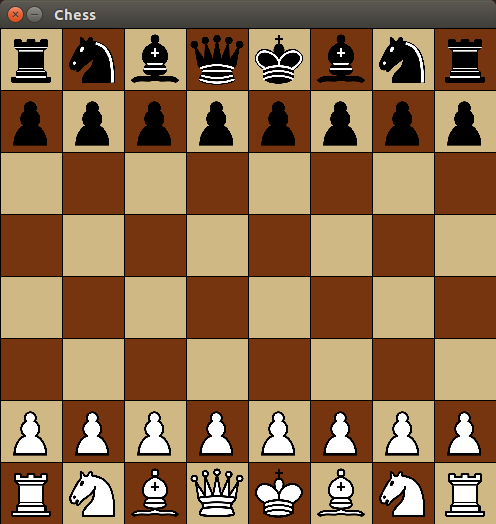

# Chess
An implementation of chess in Java

Here is the jar file: 
[Chess-1.0-SNAPSHOT.jar](https://github.com/ilinum/Chess/raw/master/Chess-1.0-SNAPSHOT.jar)

To run it, just type `java -jar Chess-1.0-SNAPSHOT.jar`
(It requires Java 8)

##The fun part
Here's the fun part: you can easily build your own AI with this. All you have to do is add this jar to dependencies, and then call GameRunner.runGame() with one of parameters being your implementation of Player interface. 
Please let me know if you build something like that, so I can link to it from this README!

###Icons used
Images were taken from [Wikimedia Commons](https://commons.wikimedia.org)

They were created by Cburnett, here is the copyright
Copyright The author
Redistribution and use in source and binary forms, with or without modification, are permitted provided that the following conditions are met:

1. Redistributions of source code must retain the above copyright notice, this list of conditions and the following disclaimer.
2. Redistributions in binary form must reproduce the above copyright notice, this list of conditions and the following disclaimer in the documentation and/or other materials provided with the distribution.
3. Neither the name of The author nor the names of its contributors may be used to endorse or promote products derived from this software without specific prior written permission.

THIS SOFTWARE IS PROVIDED BY THE AUTHOR AND CONTRIBUTORS "AS IS" AND ANY EXPRESS OR IMPLIED WARRANTIES, INCLUDING, BUT NOT LIMITED TO, THE IMPLIED WARRANTIES OF MERCHANTABILITY AND FITNESS FOR A PARTICULAR PURPOSE ARE DISCLAIMED. IN NO EVENT SHALL THE AUTHOR AND CONTRIBUTORS BE LIABLE FOR ANY DIRECT, INDIRECT, INCIDENTAL, SPECIAL, EXEMPLARY, OR CONSEQUENTIAL DAMAGES (INCLUDING, BUT NOT LIMITED TO, PROCUREMENT OF SUBSTITUTE GOODS OR SERVICES; LOSS OF USE, DATA, OR PROFITS; OR BUSINESS INTERRUPTION) HOWEVER CAUSED AND ON ANY THEORY OF LIABILITY, WHETHER IN CONTRACT, STRICT LIABILITY, OR TORT (INCLUDING NEGLIGENCE OR OTHERWISE) ARISING IN ANY WAY OUT OF THE USE OF THIS SOFTWARE, EVEN IF ADVISED OF THE POSSIBILITY OF SUCH DAMAGE.
